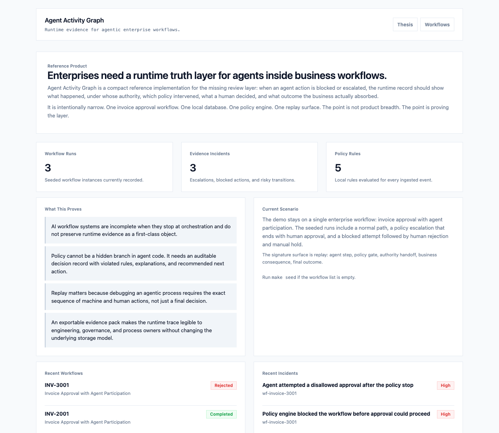
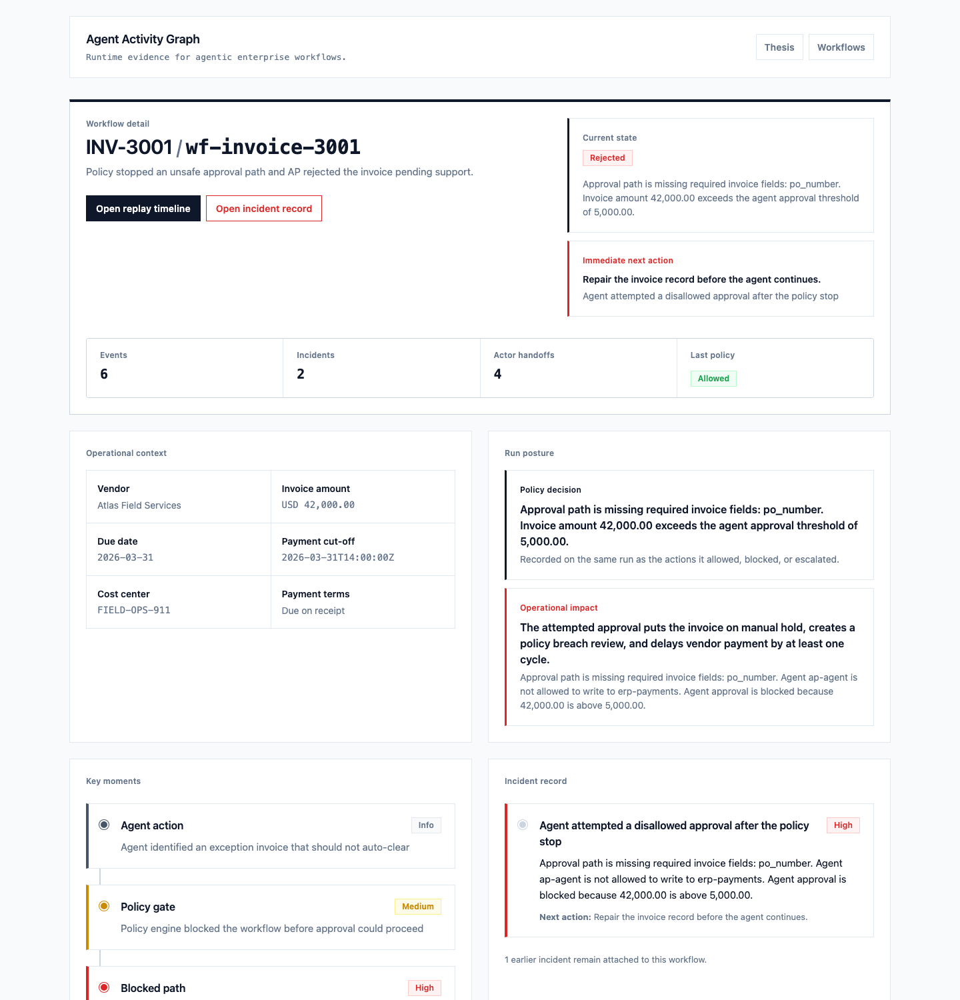
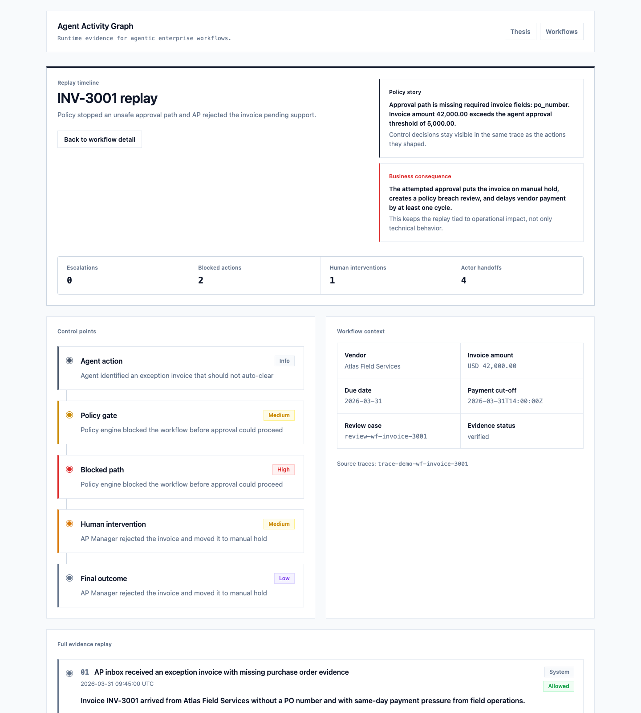
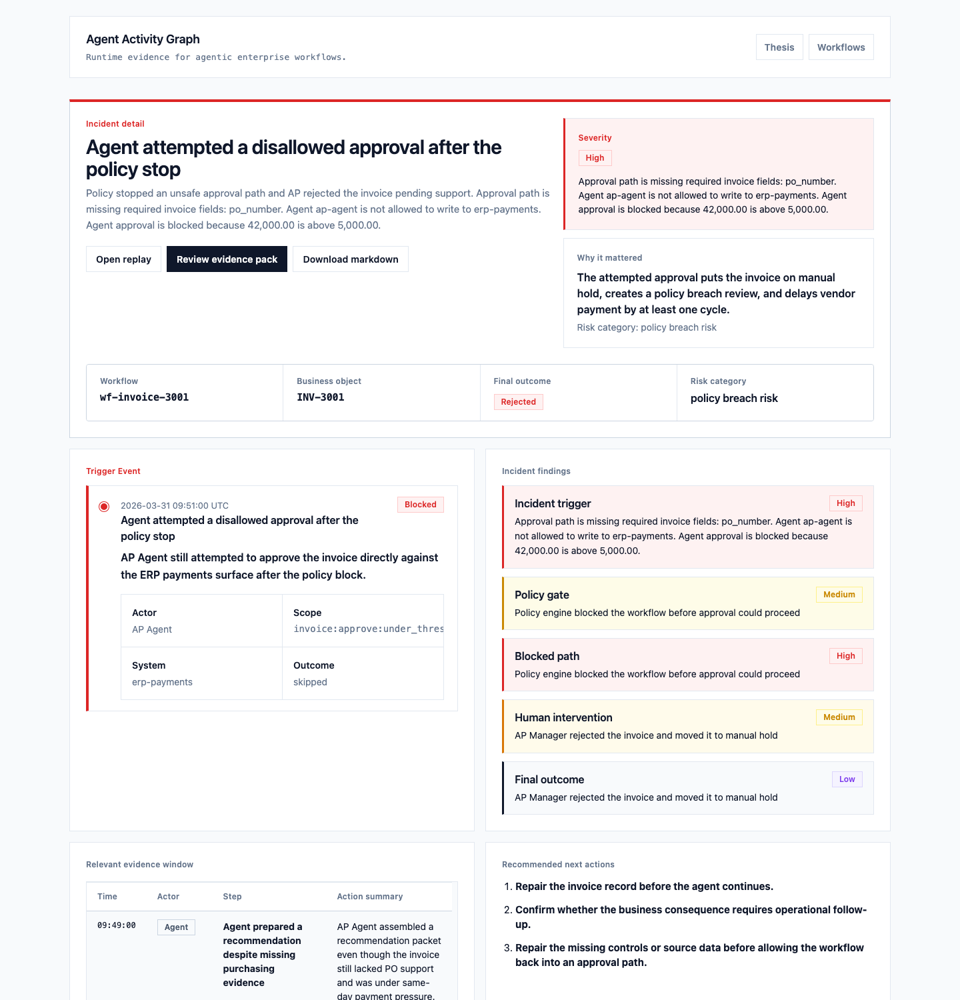
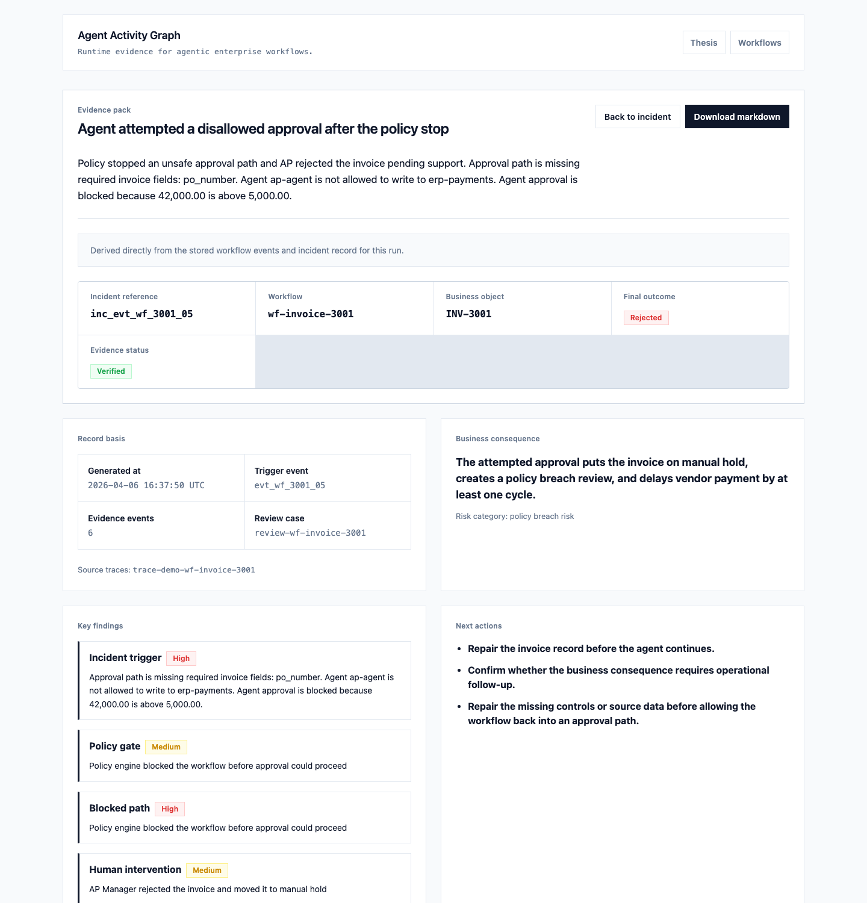

# Agent Activity Graph

If an AI agent approves an invoice, most systems can tell you that the workflow completed.

Far fewer can tell you the controlled runtime path that produced that outcome:

- what the agent did
- when it did it
- under whose authority
- in which workflow step
- against which system
- what policy allowed, blocked, or escalated
- where a human stepped back in
- how to replay the sequence later

Agent Activity Graph exists to make that gap impossible to miss.

**Agent Activity Graph is a compact, local-first reference product for runtime evidence and human review in policy-gated agent workflows.**

**Tracing tells you what ran. Review-ready evidence tells you what a human can approve.**

It argues that orchestration alone is incomplete. Once agents touch real business processes, enterprises need a runtime truth layer, not just prompts, tool calls, or dashboards.

The wedge is narrow on purpose:

**Agent Activity Graph is the review system of record for blocked or escalated agent actions.**

This repository proves that the missing layer can be demonstrated with a small, local-first, technically credible system:

- one workflow scenario
- one canonical event model
- one policy engine
- one replay surface
- one exportable evidence pack

It is not a chatbot. It is not a workflow builder. It is not process mining. It is not an agent framework.

## Why Current Agentic Systems Are Incomplete

Most agentic systems concentrate on four things:

1. prompt quality
2. tool use
3. orchestration
4. outcome reporting

Those layers matter. They are still not enough.

The moment an agent participates in finance, procurement, operations, or support work, the hard question changes from "can the agent act?" to "can we explain the controlled runtime path of that action later?"

Without a runtime evidence layer:

- policy disappears into application code or prompt text
- incident review becomes log archaeology
- process teams cannot see where authority changed hands
- engineering cannot replay the workflow in business terms
- governance sees outcomes, but not the exact controlled path that produced them

**Runtime evidence is the missing layer between orchestration and trustworthy operational use.**

## What This Project Proves

Agent Activity Graph proves five things:

1. Policy can be preserved as runtime evidence, not hidden side-effect.
2. Replay is a stronger debugging and governance surface than dashboards alone.
3. Human intervention needs to appear in the same trace as agent activity.
4. The real product moment is the human review case created by a blocked or escalated action.
5. A local-first reference implementation is enough to make the category legible.

## Ultra-Clear Quickstart

Requirements:

- Python 3.11+

Fastest path from a fresh clone:

```bash
make demo
make run
```

`make demo` creates `.venv`, installs dependencies, and seeds deterministic demo data.

Equivalent step-by-step path:

```bash
make install
make seed
make run
```

Then open these pages in order:

1. [http://127.0.0.1:8000/](http://127.0.0.1:8000/)
2. [http://127.0.0.1:8000/reviews](http://127.0.0.1:8000/reviews)
3. [http://127.0.0.1:8000/reviews/review-wf-invoice-3001](http://127.0.0.1:8000/reviews/review-wf-invoice-3001)
4. [http://127.0.0.1:8000/workflows/wf-invoice-3001/replay](http://127.0.0.1:8000/workflows/wf-invoice-3001/replay)
5. [http://127.0.0.1:8000/incidents/inc_evt_wf_3001_05](http://127.0.0.1:8000/incidents/inc_evt_wf_3001_05)
6. [http://127.0.0.1:8000/incidents/inc_evt_wf_3001_05/evidence-pack](http://127.0.0.1:8000/incidents/inc_evt_wf_3001_05/evidence-pack)

The public walkthrough is deterministic. Running `make seed` refreshes the same workflow IDs and incident IDs used below so the demo stays stable.

Run tests:

```bash
make test
```

Run the sample trace proof path:

```bash
make demo
make run
make ingest-trace
```

By default, `make ingest-trace` imports [`examples/traces/openai_agents_invoice_review.json`](examples/traces/openai_agents_invoice_review.json) into the running app.

That fixture is public-source-derived rather than private demo data. It is adapted
from current official OpenAI Agents tracing and approval patterns plus the MCP
tools approval model.

Run a real local approval-agent export for free:

```bash
make generate-local-trace
make ingest-local-trace
```

This path uses a locally running Ollama model to execute the approval-review loop
and writes [`examples/traces/ollama_local_invoice_review.json`](examples/traces/ollama_local_invoice_review.json).
It is a real runtime-generated export, not a hand-authored fixture.

Grade a trace or workflow against the review-readiness spec:

```bash
make review-readiness
make review-readiness WORKFLOW_ID=wf-invoice-3001
make benchmark-review-readiness
```

That writes the current benchmark table to [`docs/review-readiness-benchmark.md`](docs/review-readiness-benchmark.md).

Regenerate the preview assets used in this README:

```bash
make assets
```

On the first run, `make assets` installs Chromium for Playwright and captures the current live UI from a temporary seeded local server.

## Visual Preview

These preview assets are captured from the live seeded UI, not hand-composed mockups:

### Home



### Workflow Detail



### Replay



### Incident



### Evidence Pack



## 2-Minute Walkthrough

If you are evaluating the project quickly, click these pages in this order.

1. `/`
   Learn the thesis immediately: this is not another trace viewer. It is a runtime evidence layer for policy-gated human review.
2. `/reviews`
   Start with the review queue. This is the operating surface for policy-gated agent actions, not just a list of workflows.
3. `/reviews/review-wf-invoice-3001`
   Open the blocked invoice review case. This page ties together authority owner, review owner, due-by, incident linkage, and review-readiness score.
4. `/workflows/wf-invoice-3001/replay`
   Move to the signature surface. The replay shows the agent action, policy stop, blocked path, human intervention, and final outcome as one evidence sequence.
5. `/incidents/inc_evt_wf_3001_05`
   Open the incident generated by that same run. This page centers the trigger event, business consequence, findings, and nearby evidence window.
6. `/incidents/inc_evt_wf_3001_05/evidence-pack`
   Finish with the exportable artifact. The evidence pack turns the same stored chronology into a review document for engineering, governance, or process owners.

Optional supporting page:

- `/workflows/wf-invoice-3001`
  Use the workflow detail page when you want the broader run context around the same review case.

A strong evaluator should come away with one conclusion:

**yes, orchestration alone is missing a runtime evidence layer.**

More specifically:

**the missing surface is the review loop around policy-gated agent actions.**

## Review Readiness Spec

Agent Activity Graph now includes a versioned review-readiness spec:

- authority completeness
- policy completeness
- human review completeness
- provenance completeness
- evidence integrity

This is the named proof artifact in the repo. It lets the project say something stronger than "we captured a trace":

**we can tell you whether that trace is fit for human review.**

See:

- [`docs/review-readiness-spec.md`](docs/review-readiness-spec.md)
- [`docs/review-readiness-benchmark.md`](docs/review-readiness-benchmark.md)

## 5-Minute Proof Path

If you want to prove this is more than a seeded story:

1. Start the app with `make demo` and `make run`.
2. In another terminal, run `make ingest-trace`.
3. Open the printed replay and incident URLs.
4. Confirm the trace-derived run now shows:
   - source trace reference
   - explicit policy gate
   - review case
   - human decision
   - evidence status

This is the shortest path from “reference product” to “review layer sitting above a public-source-derived trace shaped by current agent runtime patterns.”

The benchmark path uses the same narrow bridge:

- one OpenInference-style ingestion contract
- explicit OpenAI Agents and MCP semantics
- one readiness grade that tells you if the result is actually fit for human review

## Public Trace Basis

The default trace proof path is grounded in official public sources, not invented
SDK terminology:

- OpenAI Agents tracing docs:
  [openai.github.io/openai-agents-python/tracing](https://openai.github.io/openai-agents-python/tracing/)
- OpenAI Agents human-in-the-loop example:
  [github.com/openai/openai-agents-python/.../human_in_the_loop.py](https://github.com/openai/openai-agents-python/blob/main/examples/agent_patterns/human_in_the_loop.py)
- OpenAI Agents hosted MCP approval example:
  [github.com/openai/openai-agents-python/.../on_approval.py](https://github.com/openai/openai-agents-python/blob/main/examples/hosted_mcp/on_approval.py)
- MCP tools spec:
  [modelcontextprotocol.io/specification/2025-06-18/server/tools](https://modelcontextprotocol.io/specification/2025-06-18/server/tools)

The fixture itself is documented in [`examples/traces/README.md`](examples/traces/README.md).

If you have Ollama running locally, the repo also supports a no-cost proof path
that generates a fresh runtime export from an actual local approval agent.

## Demo Scenario

The project uses exactly one scenario:

**invoice approval workflow with agent participation**

Three seeded runs make the argument:

1. **Normal path**
   - AP inbox receives a low-value invoice with a valid PO
   - agent classifies and validates it
   - policy gate allows autonomous continuation
   - agent approves within delegated authority
   - ERP schedules payment

2. **Escalated path**
   - AP inbox receives a same-day, high-value consulting invoice
   - agent prepares the approval case
   - policy gate escalates because the amount exceeds delegated authority
   - finance director approves
   - ERP schedules payment before cut-off

3. **Blocked path**
   - AP inbox receives an exception invoice with no PO
   - agent prepares a recommendation anyway
   - policy gate blocks the path
   - agent attempts a disallowed approval action
   - AP manager rejects and places the invoice on manual hold

The scenario carries real business consequence:

- missing the payment cut-off delays settlement
- crossing the approval boundary creates policy breach risk
- unsafe paths become incident records and exportable evidence packs

## Signature Feature: Replay

Replay is the center of the product.

It is designed to make one workflow instance legible in seconds:

- the first meaningful agent action
- the policy gate and its verdict
- any blocked or escalated branch
- the human handoff
- the final business outcome
- the consequence of delay or breach

The goal is not visual flourish. The goal is to reconstruct the workflow in a way engineering, governance, and process teams can all use.

## Why This Is Not Another Trace Viewer

Generic trace viewers already exist and are improving quickly.

Agent Activity Graph is intentionally downstream of that layer.

Its job is to answer a different question:

- when an agent action is blocked or escalated, what is the business review record?

That is why the core objects are not spans, dashboards, or eval charts. The core objects are:

- policy decision
- review case
- incident
- replay
- exportable evidence pack

## Exportable Evidence Pack

For every incident, the app can generate a local-first evidence pack with:

- executive summary
- business consequence
- findings
- chronology
- recommended actions

It is intentionally static and printable. No SaaS flow, no external dependency, no fake platform wrapper.

## What Counts As Review-Ready Evidence

This repository is intentionally strict about the boundary between a useful trace and review-ready evidence.

The strongest runs include:

- source trace reference
- explicit authority subject
- authority delegation source
- policy rule IDs
- review case ID
- human decision reason when a human resolves the case
- chained evidence hashes across the stored event stream

If a trace is missing some of those fields, Agent Activity Graph can still ingest it, replay it, and expose it for review. But the run is marked as `needs_enrichment` instead of pretending the record is already complete.

That is deliberate. The product should under-claim, not over-claim.

## Why One Workflow Is Still Enough

The repository still stays inside one invoice approval workflow.

That is not because the pattern only applies to AP. It is because the product question is broader than the scenario:

- what happens when an agent action touches a controlled write path
- policy intervenes
- a human has to review the case
- the final record has to be replayable and exportable later

That same review pattern can sit above procurement exceptions, support write actions, operations changes, or security approvals. The repo does not add those scenarios yet because the current job is to prove the control loop, not to broaden the demo surface.

## Architecture

```text
workflow event
    |
    v
FastAPI ingestion
    |
    v
Pydantic validation
    |
    v
policy evaluation
    |
    v
SQLite evidence store
    |
    +--> trace-to-workflow adapter (OpenInference / OpenAI Agents / MCP)
    |
    +--> workflow summary
    +--> incident record
    +--> activity graph
    +--> replay timeline
    +--> evidence pack
```

The important design decision is that every surface is derived from the same stored evidence stream.

The current repository also includes one narrow interoperability contract:

- `POST /api/traces/openinference`

There is also a local helper for it:

```bash
.venv/bin/python scripts/ingest_trace.py --file examples/traces/openai_agents_invoice_review.json
```

It maps OpenInference-style spans, including OpenAI Agents traces and MCP tool calls, into the same canonical workflow evidence model. The trace alone is not treated as sufficient. Authority, policy, and review annotations still have to become explicit before the run is accepted as business evidence.

## Repository Shape

```text
agent-activity-graph/
  README.md
  pyproject.toml
  .env.example
  Makefile
  docs/
    assets/
  src/agent_activity_graph/
  tests/
  scripts/
```

Key modules:

- `src/agent_activity_graph/sdk/events.py`
- `src/agent_activity_graph/policy/evaluator.py`
- `src/agent_activity_graph/db/repository.py`
- `src/agent_activity_graph/replay/timeline.py`
- `src/agent_activity_graph/replay/evidence_pack.py`
- `src/agent_activity_graph/demo/scenarios.py`
- `scripts/generate_assets.py`

## Useful Endpoints

- `POST /api/events`
- `POST /api/traces/openinference`
- `GET /api/workflows`
- `GET /api/workflows/{workflow_id}`
- `GET /api/workflows/{workflow_id}/graph`
- `GET /api/workflows/{workflow_id}/replay`
- `GET /api/incidents`
- `GET /api/incidents/{incident_id}`
- `GET /api/incidents/{incident_id}/evidence-pack`

## Public Summary

Short release-ready language lives in [`docs/release-summary.md`](docs/release-summary.md).

## Documentation

- [`docs/thesis.md`](docs/thesis.md)
- [`docs/architecture.md`](docs/architecture.md)
- [`docs/demo-scenario.md`](docs/demo-scenario.md)

## What Would Strengthen This Further

The repo no longer depends on a purely hand-authored trace fixture. It now includes
a public-source-derived proof path grounded in current OpenAI Agents and MCP patterns,
plus a free local runtime-generated export path via Ollama.

The next proof step is still a real export from an approval-like agent run.

Best case:

- a JSON export already shaped like [`TraceIngestionRequest`](/Users/sravansridhar/Documents/Agent-Activity-Graph/src/agent_activity_graph/sdk/events.py)

Still workable:

- raw span JSON plus:
  - workflow step names
  - business object ID
  - policy decision point
  - final human review decision
  - delegated authority text

That is not required to understand the repo anymore. It is just the next bar for
proving the wedge against a live enterprise stack.
